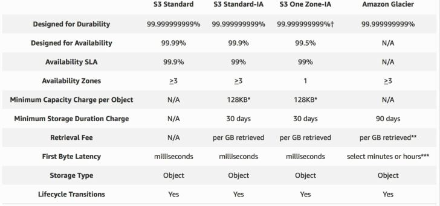

# Section 4 - AWS Object Storage and CDN - S3, Glacier and CloudFront

This section will cover an in-depth overview on the S3 (Simple Storage Service) service.

### What is S3?
* S3 provides developers and IT teams with secure, durable, highly-scalable object storage. Amazon S3 is easy to use, with a simple web services interface to store and retrieve any amount of data from anywhere on the web
* S3 is a safe place to store your files
* S3 is an object-based storage
* The data is spread across multiple devices and facilities

### S3 - The Basics
* S3 is Object-based - i.e. allows you to upload files
* Files can be from 0 Bytes to 5 TB
* There is unlimited storage
* Files are stored in Buckets
* S3 is a universal namespace - names must be unique globally
* URLs look like https://s3-eu-west-1.amazonaws.com/<name>
* When you upload a file to S3 you will receive a HTTP 200 code if the upload was successful

### Data Consistency Model for S3
* Read after Write consistency for PUTS of new Objects
* Eventual Consistency for overwrite PUTS and DELETES (can take some time to propagate)

### S3 is a Simple Key-value Store
Objects consist of the following:
 * Key (this is the name of the object)
 * Value (this is the data and is made up of a sequence of bytes)
 * Version ID (important for versioning)
 * Metadata (Data about data you are storing)
 * Sub resources:
    * Access Control Lists
    * Torrent

### S3 - The Basics (Continued)
* Built for 99.99% availability for the S3 platform.
* Amazon guarantee 99.9% availability
* Amazon guarantee 99.99999999999% durability for S3 information (11 x 9s)
* Tiered storage available
* Lifecycle Management
* Versioning
* Encryption
* Secure your data using Access Control Lists and Bucket Policies

### S3 - Storage Tiers/Classes
* S3 Standard: 99.99% availability, 99.9999999999% durability, stored redundantly across multiple devices in multiple facilities, and is designed to sustain the loss of 2 facilities concurrently
* S3 - IA: (Infrequently Accessed): For data that is accessed less frequently, but requires rapid access when needed. Lower fee than S3 but you are charged a retrieval fee
* S3 One Zone - IA: Want a lower-cost option for infrequently accessed data but do not require the multiple AZ data resilience
* Glacier: Very cheap but used for archival only. Expedited, Standard or Bulk. A standard retrieval time takes 3-5 hours

  
  <h3>Figure 4-1. S3 Storage classes and info</h3>

### S3 - Charges
In S3, we are charged for:
* Storage
* Requests
* Storage Management Pricing
* Data Transfer Pricing
* Transfer Acceleration

### What is S3 Transfer Acceleration?
AWS S3 Transfer Acceleration enables fast, easy, and secure transfers of files over long distances between your end users and an S3 bucket. Transfer Acceleration takes advantage of AWS CloudFront's globally distributed edge locations. As the data arrives at an edge location, data is routed to AWS S3 over an optimized network path.

