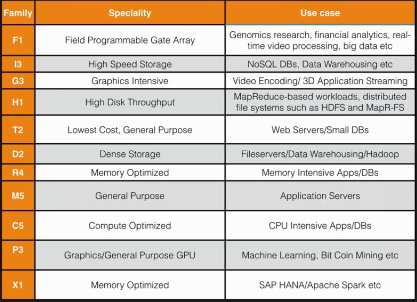
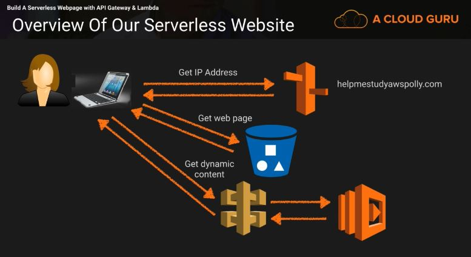
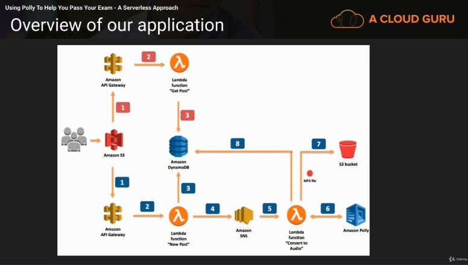

# Section 5: EC2 - The Backbone of AWS

This section will cover an in-depth overview on the AWS Elastic Compute Cloud (EC2) service.

### What is EC2?
Amazon EC2 (Elastic Cloud Compute) is a web service that provides resizable compute capacity in the cloud. Amazon EC2 reduces the time required to obtain and boot new server instances to minutes, allowing you to quickly scale capacity, both up and down, as your computing requirements change.

EC2 changes the economics of computing by allowing you to pay only for capacity that you actually use. EC2 provides developers the tools to build failure resilient applications and isolate themselves from common failure scenarios.

### EC2 Options
* On Demand - Allows you to pay a fixed rate by the hour (or by the second) with no commitment
* Reserved - Provides you with a capacity reservation and offers a significant discount on the hourly charge for an instance. 1 year or 3 year terms
* Spot - Enables you to bid whatever price you want for instance capacity, providing for even greater savings if your applications have flexible start and end times
* Dedicated Hosts - Physical EC2 server dedicated for you use. Dedicated Hosts can help you reduce costs by allowing you to use your existing server-bound software licenses

### On Demand
* Perfect for users that want the low cost and flexibility of EC2 without any up-front payment or long-term commitment
* Applications with short term, spiky, or unpredictable workloads that cannot be interrupted
* Applications being developed or tested on EC2 for the first time

### Reserved
* Applications with steady state or predictable usage
* Applications that require reserved capacity
* Users can make up-front payments to reduce their total computing costs even further
  * Standard RIs (up to 75% off on-demand)
  * Convertible RIs (up to 54% off on-demand) feature the capability to change the attributes of the RI as long as the exchange results in the creation of Reserved Instances of equal or greater value
  * Schedule RIs are available to launch within the time window you reserve. This option allows you to match your capacity reservation to a predictable recurring schedule that only requires a fraction of a day, week, or month

### Spot
* Applications that have flexible start and end times
* Applications that are only feasible at very low compute prices
* Users with an urgent need for large amounts of additional computing capacity

### Dedicated Hosts
* Useful for regulatory requirements that may not support multi-tenant virtualization
* Great for licensing which does not support multi-tenancy or cloud deployments
* Can be purchased on-demand (hourly)
* Can be purchased as a Reservation for up to 70% off the on-demand price

### EC2 Instance Types

  
  <h3>Figure 5-1. EC2 instance types, specialties and use cases</h3>

### What is EBS?
Amazon EBS (Elastic Block Storage) allows you to create storage volumes and attach them to EC2 instances. Once attached, you can create a file system on top of these volumes, run a database, or use them in any other way you would use a block device. EBS volumes are placed in a specific AZ where they are automatically replicated to protect you from the failure of a single component.

### EBS Volume Types
* General Purpose SSD (GP2)
  * General purpose, balances both price and performance
  * Ratio of IOPS per GB with up to 10,000 IOPS and the ability to burst up to 300 IOPS for extended periods of time for volumes at 3334 GB and above
* Provisioned IOPS SSD (101)
  * Designed for I/O intensive applications such as large relational or NoSQL databases
  * Use if you need more than 10,000 IOPS
  * Can provision up to 20,000 IOPS per volume
* Throughput Optimized HDD (ST1)
  * Big data
  * Data warehouses
  * Log processing
  * Cannot be a boot volume
* Cold HDD (SC1)
  * Lowest cost storage for infrequently accessed workloads
  * File server
  * Cannot be a boot volume
* Magnetic (Standard)
* Lowest cost per GB of all EBS volume types that is bootable. Magnetic volumes are ideal for workloads where data is accessed infrequently, and applications where the lowest storage cost is important

### EC2 Exam Tips
* Know On-Demand, Reserved, Spot, and Dedicated Host EC2 services
* If a Spot instance is terminated by EC2, you will not be charged for a partial hour of usage. However, if you terminate the instance yourself, you will be charged for the complete hour in which the instance ran
* Know FIGHT DR MC PX acronym (EC2 instance types, specialties and use cases)
* SSD:
  * General Purpose SSD - Balance price and performance for a wide variety of workloads
  * Provisioned IOPS SSD - Highest performance SSD volume for mission-critical low-latency or high-throughput workloads

* Magnetic:
  * Throughput Optimized HDD - Low cost HDD volume designed for frequently accessed, throughput-intensive workloads
  * Cold HDD - Lowest cost HDD volume designed for less frequently accessed workloads
  * Magnetic - Previous generation. Can be boot volume

### EC2 Lab Summary
* Termination Protection is turned off by default, you must turn it on
* On an EBS-backed instance, the default action is for the root EBS volume to be deleted when the instance is terminated
* EBS root volumes of your DEFAULT AMI's cannot be encrypted. You can also use a third party tool (such as bit locker) to encrypt the root volume, or this can be done when creating AMI's in the AWS console or using the API

### Security Group Basics
* All inbound traffic is blocked by default
* All outbound traffic is allowed
* Changes to security groups take effect immediately
* You can have any number of EC2 instances within a security group
* You can have multiple security groups attached to EC2 instances
* Security groups are STATEFUL (network access control lists are STATELESS):
  * If you create an inbound rule allowing traffic in, that traffic is automatically allowed back out again
* You cannot block specific IP addresses using security groups, instead use Network Access Control Lists
* You can specify allow rules but not deny rules

### Volumes and Snapshots
* Volumes exist on EBS:
  * Virtual Hard Disk
* Snapshots exist on S3
* Snapshots are point in time copies of volumes
* Snapshots are incremental - this means that only the blocks that have changed since your last snapshot are moved to S3

### Snapshots of Root Device Volumes
* To create a snapshot for EBS volumes that serve as root devices, you should stop the instance before taking the snapshot
* However, you can take while the instance is running
* You can create AMI's from EBS-backed instances and snapshots
* You can change EBS volume sizes on the fly, including changing the size and storage type
* Volumes will ALWAYS be in the same AZ as the EC2 instance
* To move an EC2 volume from one AZ/Region to another, take a snap or an image of it, then copy it to the new AZ/Region

### Volume vs Snapshots - Security
* Snapshots of encrypted volumes are encrypted automatically
* Volumes restored from encrypted snapshots are encrypted automatically
* You can share snapshots, but only if they are unencrypted
  * These snapshots can be shared with other AWS accounts or made public

### RAID, Volumes and Snapshots
* RAID - Redundant Array of Independent Disks
  * RAID 0 - Striped, No Redundancy, Good Performance
  * RAID 1 - Mirrored, Redundancy
  * RAID 5 - Good for reads, bad for writes, AWS does not recommend ever putting RAID 5's on EBS
  * RAID 10 - Striped and Mirrored, Good Redundancy, Good Performance

### Snapshots of a RAID array
* Problem - Take a snapshot, the snapshot excludes data held in the cache by applications and the OS. This tends not to matter on a single volume, however using multiple volumes in a RAID array, this can be a problem due to interdependencies of the array
* Solution - Take an application consistent snapshot
  * Stop the application from writing to disk
  * Flush all caches to the disk
  * Ways to accomplish these tasks above:
    * Freeze the file system
    * Unmount the RAID array
    * Shutting down the associated EC2 instance

### EBS vs Instance Store
* All AMIs are categorized as either backed by EBS or backed by instance store
* For EBS volumes - The root device for an instance launched from the AMI is an EBS volume created from an EBS snapshot
* For instance store volumes - The root device for an instance launched from the AMI is an instance store volume created from a template stored in S3

### EBS vs Instance Store - Exam Tips
* Instance store volumes are sometimes called Ephemeral Storage
* Instance store volumes cannot be stopped. If the underlying host fails, you lose your data
* EBS backed instance can be stopped. You will not lose the data on this instance if it is stopped
* You can reboot both, you will not lose your data
* By default, both ROOT volumes will be deleted on termination, however with EBS volumes, you can tell AWS to keep the root device volume

### Types of Load Balancers
Three types of load balancers:
* Application load balancer - Are best suited for load balancing of HTTP and HTTPS traffic. They operate at Layer 7 and are application-aware. They are intelligent, and you can create advanced request routing, sending specified requests to specific web servers
* Network load balancer - Are best suited for load balancing of TCP traffic where extreme performance is required. Operating at the connection level (Layer 4), network load balancers are capable of handling millions of requests per second, while maintaining ultra-low latencies. Use for extreme performance
* Classic load balancer - Are the legacy ELB (Elastic Load Balancers). You can load balance HTTP/HTTPS applications and use Layer 7-specific features, such as X-Forwarded and sticky sessions. You can also use strict Layer 4 load balancing for applications that rely purely on the TCP protocol

### Load Balancer Errors
* Classic Load Balancers - If your application stops responding the ELB responds with a 504 error. This means that the application is having issues. This could be either at the Web Server layer or at the Database Layer. Identify where the application is failing and scale it up or out where possible

### ELB Exam Tips
* 3 types of load balancers:
  * Application load balancers
  * Network load balancers
  * Classic load balancers
* 504 error means that the gateway has timed out. This means that the application not responding within the idle timeout period.
  * Trouble shoot the application. Is it the Web Server or Database Server?
* If you need the IPv4 address of your end user, look for the X-Forwarded-For-Header

### Elastic Load Balancers Lab
* Instances monitored by ELB are reported as “In Service” or “Out of Service”
* Health Checks - Check the instance health by talking to it
* ELBs have their own DNS name. You are never given an IP address
* Read the ELB FAQ for Classic Load Balancers

### CloudWatch EC2 Lab
* Standard Monitoring - 5 minute
* Detailed Monitoring - 1 minute
* What can I do with CloudWatch?
  * Dashboards - Create awesome dashboards to see what is happening with your AWS environment
  * Alarms - Allows you to set Alarms that notify you when particular thresholds are hit
  * Events - CloudWatch events helps you respond to state changes in your AWS resources
  * Logs - CloudWatch logs helps you aggregate, monitor, and store logs

### The AWS Command Line and EC2
* When we configure AWS via command line we are actually storing credentials locally on the EC2 instance
* Using user credentials is not safe and storing them on EC2 instances is not recommended

### Using IAM roles with EC2
* Roles help secure credentials in AWS EC2
* Remember that all roles are global so there is no need to create a new role in another Region

### S3 CLI and Regions
* You can now actually attach a role to an EC2 instance via CLI or AWS console

### Using Bootstrap Scripts
* Bash scripts are always passed in the Advanced Details tab
* We use #!/bin/bash to start the bash script
* Bash scripts allows us to automate our web servers

### EC2 Instance Metadata
Instance metadata is data about your instance that you can use to configure or manage the running instance. Instance metadata is divided into categories.

Although you can only access instance metadata and user data from within the instance itself, the data is not protected by cryptographic methods. Anyone who can access the instance can view its metadata. Therefore, you should take suitable precautions to protect sensitive data (such as long-lived encryption keys). You should not store sensitive data, such as passwords, as user data.

You can also use instance metadata to access user data that you specified when launching your instance. For example, you can specify parameters for configuring your instance, or attach a simple script. You can also use this data to build more generic AMIs that can be modified by configuration files supplied at launch time. For example, if you run web servers for various small businesses, they can all use the same AMI and retrieve their content from the Amazon S3 bucket you specify in the user data at launch. To add a new customer at any time, simply create a bucket for the customer, add their content, and launch your AMI. If you launch more than one instance at the same time, the user data is available to all instances in that reservation.

EC2 instances can also include dynamic data, such as an instance identity document that is generated when the instance is launched.

For more information on EC2 instance metadata see the AWS EC2 guide on [Instance Metadata and User Data](https://docs.aws.amazon.com/AWSEC2/latest/UserGuide/ec2-instance-metadata.html).

### Autoscaling Lab
An important take away is that you can have instances spread across multiple AZs and even if you lose two of those AZ out of three you still won't have an outage. Route 53 can also help further protect from regional failure by detecting failure and redirecting traffic to other parts of the world.

### EC2 Placement Groups
There are two types of placement groups:
* Clustered Placement Group - A grouping of instances within a single AZ. Placement groups are recommended for applications that need low network latency, high network throughput, or both. Only certain instances can be launched into a clustered placement group
* Spread Placement Group - A group of instances that are each placed on distinct underlying hardware. Spread placement groups are recommended for applications that have a small number of critical instances that should be kept separate from each other

Things to review before the exam:
* A clustered placement group can't span multiple AZ
* A spread placement group can span multiple AZ
* The name you specify for a placement group must be unique within your AWS account
* Only certain types of instances can be launched in a placement group (Compute Optimized, GPU, Memory Optimized, Storage Optimized)
* AWS recommend homogenous instances within placement groups
* You can't merge placement groups
* You can't move an existing instance into a placement group. You can create an AMI from your existing instance, and then launch a new instance from the AMU into a placement group

### What is EFS?
Amazon EFS (Elastic File System) is a file storage service for Amazon EC2 instances. Amazon EFS is easy to use and provides a simple interface that allows you to create and configure file systems quickly and easily. With EFS, storage capacity is elastic, growing and shrinking automatically as you add and remove files, so your applications have the storage they need, when they need it.

### EFS Features
* Supports the Network File System version 4 (NFSv4) protocol
* You only pay for the storage you use (no pre-provisioning required)
* Can scale up to the petabytes
* Can support thousands of concurrent NFS connections
* Data is stored across multiple AZ's within a region
* Read After Write Consistency

Use case for EFS:
* Using EFS as a file server or a central repository for your files within your EC2 instances
* Can set restrictions which will be reflected across all EC2 instances
* EFS allows multiple EC2 instances to connect to it whereas EBS can only mount to a single EC2 instance

### What is Lambda?
AWS Lambda is a compute service where you can upload your code and create a Lambda function. AWS Lambda takes care of provisioning and managing the servers that you use to run the code. You don't have to worry about operating systems, patching, scaling, etc. You can use Lambda in the following ways:

* As an event-driven compute service where the AWS Lambda runs your code in response to events. These events could be changes to data in an Amazon S3 bucket or an Amazon DynamoDB table
* As a compute service to run your code in response to HTTP requests using Amazon API Gateway or API calls made using AWS SDKs

Lambda is an encapsulation of the following:
* Data Centers
* Hardware
* Assembly Code/Protocols
* High Level Languages
* Operating Systems
* Application Layer/AWS APIs
* AWS Lambda

### How is Lambda Priced?
* Number of requests:
  * First 1 million requests are free. $0.20 per 1 million requests thereafter
* Duration:
  * Calculated from the time your code begins executing until it returns or otherwise terminates, rounded up to the nearest 100 ms. The price depends on the amount of memory you allocate to your function. You are charged $0.00001667 for every GB-second used

### Why is Lambda Cool?
* No servers!
* Continuous scaling!
* Super cheap!

### Lambda - Exam Tips
* Lambda scales out (not up) automatically
* Lambda functions are independent, 1 event = 1 function
* Lambda is serverless
* Know what services are serverless!
* Lambda function can trigger other lambda functions, 1 event can = x functions if functions trigger other functions

* Architectures can get extremely complicated, AWS X-ray allows you to debug what is happening
* Lambda can do things globally, you can use it to back up S3 buckets to other S3 buckets etc.
* Know triggers

### Build a Serverless Page
Below is a schematic of how the lambda serverless website will work with Route 53, API Gateway, Lambda, and S3. The steps are as follows:

1. Get IP address
2. Route 53 returns IP address
3. Get web page from S3
4. Return static/dynamic content
5. Get request to API Gateway
6. Forward request to Lambda
7. Return data to user

  
  <h3>Figure 5-2. Lambda serverless web schematic</h3>

### Using Polly
Below is a schematic of how Polly will be set up in AWS. Polly converts text into an MP3 file.

  
  <h3>Figure 5-3. Overview of Polly application</h3>

### EC2 Summary
Below are the major subsections in Section 5 worth going over before the exam.

#### Exam Tips - EC2
* Know the differences between:
  * On Demand
  * Spot
  * Reserved
  * Dedicated Hosts
* Remember with spot instances:
  * If you terminate the instance, you pay for the hour
  * If AWS terminates the spot instance, you get the hour it was terminated in for free

* Know the EC2 instance types as shown in Figure 5-1

#### Exam Tips - EBS
* EBS Consists of:
  * SSD, General Purpose - GP2 - (up to 10,000 IPOS)
  * SSD, Provisioned IOPS - IO1 - (more than 10,000 IOPS)
  * HDD, Throughput Optimized - ST1 - Frequently accessed workloads
  * HDD, Cold - SC1 - Less frequently accessed data
  * HDD, Magnetic - Standard - Cheap, infrequently accessed storage

* You cannot mount a single EBS volume to multiple EC2 instances; instead use EFS

#### Exam Tips - EC2 Lab
* Termination Protection is turned off by default, you must turn it on
* On an EBS-backed instance, the default action is for the root EBS volume to be deleted when the instance is terminated
* EBS-backed root volumes can now be encrypted using AWS API or console or you can use a third party tool to encrypt the root volume
* Additional volumes can also be encrypted

#### Exam Tips - Volumes vs Snapshots
* Volumes exist on EBS:
  * Virtual hard disk
* Snapshots exist on S3
* You can take a snapshot of a volume, this will store that volume on S3
* Snapshots are point in time copies of volumes
* Snapshots are incremental. This means that only the blocks that have changed since your last snapshot are moved to S3
* It may take some time to create the first snapshot

#### Exam Tips - Volumes vs Snapshots - Security
* Snapshots of encrypted volumes are encrypted automatically
* Volumes restored from encrypted snapshots are encrypted automatically
* You can share snapshots, but only if they are unencrypted
  * These snapshots can be shared with other AWS accounts or made public

#### Exam Tips - Snapshots of Root Device Volumes
* To create a snapshot for Amazon EBS volumes that serve as root devices, you should stop the instance before taking the snapshot

#### Exam Tips - EBS vs Instance Store
* Instance store volumes are sometimes called Ephemeral Storage
* Instance store volumes cannot be stopped. If the underlying host fails, you lose your data
* EBS backed instance can be stopped. You will not lose the data on this instance if it is stopped
* You can reboot both, you will not lose your data
* By default, both ROOT volumes will be deleted on termination, however with EBS volumes, you can tell AWS to keep the root device volume

### How to take Snapshots of a RAID array
* Problem - Take a snapshot, the snapshot excludes data held in the cache by applications and the OS. This tends not to matter on a single volume, however using multiple volumes in a RAID array, this can be a problem due to interdependencies of the array
* Solution - Take an application consistent snapshot
  * Stop the application from writing to disk
  * Flush all caches to the disk
  * Ways to accomplish these tasks above:
    * Freeze the file system
    * Unmount the RAID array
    * Shutting down the associated EC2 instance

#### Exam Tips - Amazon Machine Images
AMIs are regional. You can only launch an AMI from the region in which it is stored. However you can copy AMIs to other regions using the console, command line, or the Amazon EC2 API

#### Exam Tips - CloudWatch Lab
* Standard Monitoring - 5 minute
* Detailed Monitoring - 1 minute

* CloudWatch is performance monitoring
* CloudTrail is for auditing

#### What can I do with CloudWatch?
  * Dashboards - Create awesome dashboards to see what is happening with your AWS environment
  * Alarms - Allows you to set Alarms that notify you when particular thresholds are hit
  * Events - CloudWatch events helps you respond to state changes in your AWS resources
  * Logs - CloudWatch logs helps you aggregate, monitor, and store logs

#### Exam Tips - Roles Lab
* Roles are more secure than storing your access key and secret access key on individual EC@ instances
* Roles are easier to manage
* Roles can be assigned to an EC2 instance AFTER it has been provisioned using both the command line and the AWS console
* Roles are universal - you can use them in any region

#### Exam Tips - Instance Metadata
* Used to get information about an instance (such as public IP)

#### Exam Tips - EFS Lab
* Supports the Network File System version 4 (NFSv4) protocol
* You only pay for the storage you use (no pre-provisioning required)
* Can scale up to the petabytes
* Can support thousands of concurrent NFS connections
* Data is stored across multiple AZ's within a region
* Read After Write Consistency

#### What is Lambda?
AWS Lambda is a compute service where you can upload your code and create a Lambda function. AWS Lambda takes care of provisioning and managing the servers that you use to run the code. You don't have to worry about operating systems, patching, scaling, etc. You can use Lambda in the following ways:

* As an event-driven compute service where the AWS Lambda runs your code in response to events. These events could be changes to data in an Amazon S3 bucket or an Amazon DynamoDB table
* As a compute service to run your code in response to HTTP requests using Amazon API Gateway or API calls made using AWS SDKs

#### What is a Placement Group?
There are two types of placement groups:
* Clustered Placement Group - A grouping of instances within a single AZ. Placement groups are recommended for applications that need low network latency, high network throughput, or both. Only certain instances can be launched into a clustered placement group
* Spread Placement Group - A group of instances that are each placed on distinct underlying hardware. Spread placement groups are recommended for applications that have a small number of critical instances that should be kept separate from each other

## Section 5 Quiz

**1. EBS Snapshots are backed up to S3 in what manner?**
* Incrementally

**2. Do Amazon EBS volumes persist independently from the life of an Amazon EC2 instance, for example, if I terminated an EC2 instance, would that EBS volume remain?**
* Only if instructed to when created

**3. Can I delete a snapshot of an EBS Volume that is used as the root device of a registered AMI?**
* No, you must deregister the AMI before being able to delete the root device

**4. A placement group can be deployed across multiple Availability Zones.**
* False

**5. While creating the snapshots using the command line tools, which command should I be using?**
* ec2-create-snapshot

**6. Can you attach an EBS volume to more than one EC2 instance at the same time?**
* No

**7. A placement group is ideal for**
* EC2 instances that require high network throughput and low latency across a single AZ

**8. Using the console, I can add a role to an EC2 instance, after that instance has been created and powered up.**
* True

**9. I can change the permissions to a role, even if that role is already assigned to an existing EC2 instance, and these changes will take effect immediately.**
* True
