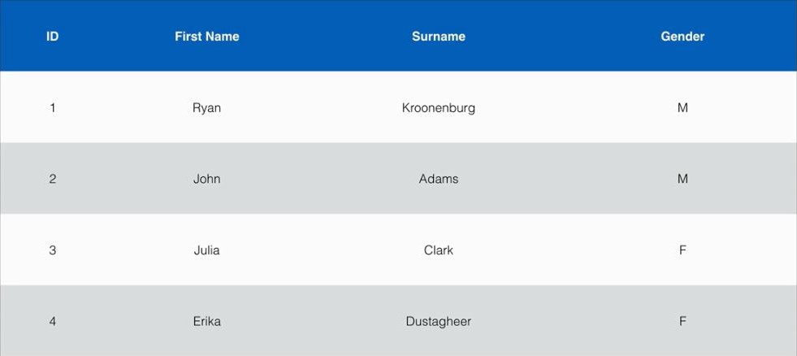

# Section 7: Databases on AWS

This section will cover an in-depth overview on databases on AWS.

### What is a relational database?
Relational databased are what most of us are all used to. They have been around since the 70's (think traditional spreadsheet):
* Database
* Tables
* Row
* Fields (columns)

  
  <h3>Figure 7-1. Example of a traditional relational database</h3>

### Relational Database Types
There are several of relational database types:
* SQL server
* Oracle
* MySQL server
* PostgreSQL
* Aurora
* MariaDB

### Non-relational Databases
A non-relational database consists of the following:
* Database
  * Collection -> Table
  * Document -> Row
  * Key value pairs -> Fields

  
  <h3>Figure 7-2. Example of a non-relational database</h3>

### What is Data Warehousing?
* Used for business intelligence. Tools like Cognos, Jaspersoft, SQL Server Reporting Services, Oracle Hyperion, SAP NetWeaver
* Used to pull in very large and complex data sets. Usually used by management to do queries on data (such as current performance vs targets, etc.)

### OLTP vs OLAP
* OLTP (Online Transaction Processing) differs from OLAP (Online Analytics Processing) in terms of the types of queries you will run
* OLTP: Pulls up a row of data such as name, date, delivery address, delivery status, etc.
* OLAP: Find net profit for EMEA and Pacific for the Digital Radio Product:
  1.  Pulls in large number of records
  2.  Sum of radios sold in EMEA
  3.  Sum of radios sold in Pacific
  4.  Unit cost of radio in each region
  5.  Sales price of each radio
  6.  Sales price - unit cost
* Data warehousing databases use different type of architecture both from a database perspective and infrastructure layer

### What is ElastiCache?
* ElastiCache is a web service that makes it easy to deploy, operate, and scale an in-memory cache in the cloud. The service improves the performance of web applications by allowing you to retrieve information from fast, managed, in-memory caches, instead of relying entirely on slower disk-based databaseds
* ElastiCache supports two open-source in-memory caching engines:
  * Memcached
  * Redis

### AWS Database Types - Summary
* RDS - OLTP
  * SQL
  * MySQL
  * PostgreSQL
  * Oracle
  * Aurora
  * MariaDB
* DynamoDB - No SQL
* RedShift - OLAP
* ElastiCache - In Memory Caching
