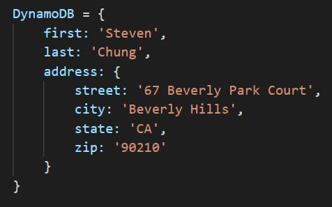
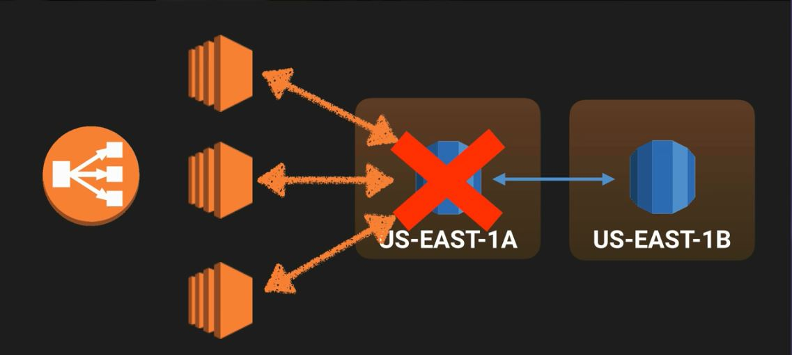
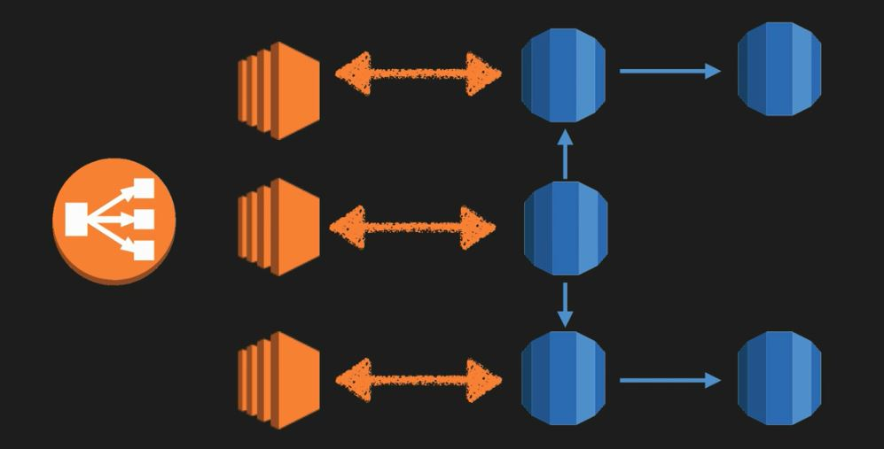

# Section 7: Databases on AWS

This section will cover an in-depth overview on databases on AWS.

### What is a relational database?
Relational databased are what most of us are all used to. They have been around since the 70's (think traditional spreadsheet):
* Database
* Tables
* Row
* Fields (columns)

  
  <h3>Figure 7-1. Example of a traditional relational database</h3>

### Relational Database Types
There are several of relational database types:
* SQL server
* Oracle
* MySQL server
* PostgreSQL
* Aurora
* MariaDB

### Non-relational Databases
A non-relational database consists of the following:
* Database
  * Collection -> Table
  * Document -> Row
  * Key value pairs -> Fields

  
  <h3>Figure 7-2. Example of a non-relational database</h3>

### What is Data Warehousing?
* Used for business intelligence. Tools like Cognos, Jaspersoft, SQL Server Reporting Services, Oracle Hyperion, SAP NetWeaver
* Used to pull in very large and complex data sets. Usually used by management to do queries on data (such as current performance vs targets, etc.)

### OLTP vs OLAP
* OLTP (Online Transaction Processing) differs from OLAP (Online Analytics Processing) in terms of the types of queries you will run
* OLTP: Pulls up a row of data such as name, date, delivery address, delivery status, etc.
* OLAP: Find net profit for EMEA and Pacific for the Digital Radio Product:
  1.  Pulls in large number of records
  2.  Sum of radios sold in EMEA
  3.  Sum of radios sold in Pacific
  4.  Unit cost of radio in each region
  5.  Sales price of each radio
  6.  Sales price - unit cost
* Data warehousing databases use different type of architecture both from a database perspective and infrastructure layer

### What is ElastiCache?
* ElastiCache is a web service that makes it easy to deploy, operate, and scale an in-memory cache in the cloud. The service improves the performance of web applications by allowing you to retrieve information from fast, managed, in-memory caches, instead of relying entirely on slower disk-based databases
* ElastiCache supports two open-source in-memory caching engines:
  * Memcached
  * Redis

### AWS Database Types - Summary
* RDS - OLTP
  * SQL
  * MySQL
  * PostgreSQL
  * Oracle
  * Aurora
  * MariaDB
* DynamoDB - No SQL
* Redshift - OLAP
* ElastiCache - In Memory Caching

### RDS - Backups, Mult-AZ, and Read Replicas
* There are two different types of backups for AWS
  * Automated backups
  * Database snapshots
* Automated backups allow you to recover your database to any point in time within a "retention period"
* The retention period can be between one and 35 days. Automated backups will take a full daily snapshot and will also store transaction logs throughout the day. When you do a recovery. AWS will first choose the most recent daily back up, and then apply transaction logs relevant to that day. This allows you to do a point in time recovery down to a second, within the retention period

### Automated Backups
* Automated backups are enabled by default. The backup data is stored in S3 and you get free storage space equal to the size of your database. SO if you have an RDS instance of 10 GB, you will get 10 GB worth of storage
* Backups are taken within a defined window. During the backup window, storage I/O may be suspended while your data is being backed up and you may experience elevated latency

### Snapshots
DB Snapshots are done manually (i.e. they are user initiated) and are stored even after you delete the original RDS instance, unlike automated backups.

### Restoring Backups
Whenever you restore either an automatic backup or a manual Snapshot, the restored version of the database will be a new RDS instance with a new DNS endpoint.

### Encryption
* Encryption at rest is supported for MySQL, Oracle, SQL Server, PostgreSQL, MariaDB, and Aurora. Encryption is done using AWS KMS (Key Management Service). Once your RDS instance is encrypted, the data stored at rest in the underlying storage is encrypted, as are its automated backups, read replicas, and snapshots
* At the present time, encrypting an existing DB instance is not supported. To use Amazon RDS encryption for an existing database, you must first create a snapshot, make a copy of that snapshot and encrypt the copy

### What is Multi-AZ?
Any changes to an RDS in US-EAST-1A for example will be synchronously replicated in another instance in US-EAST-1B for example where US-EAST-1B is an exact copy of US-EAST-1A.

  
  <h3>Figure 7-3. Example of a Multi-AZ setup for AWS RDS</h3>

### What is Multi-AZ RDS?
* Multi-AZ allows you to have an exact copy of your production database in another AZ. AWS handles the replication for you so when your production databases is written to, this will automatically be synchronized to the stand by database
* In the event of planned database maintenance, DB instance failure, or an AZ failure, Amazon RDS will automatically failover to the standby so that database operations can resume quickly without administrative intervention
* **Multi-AZ is for disaster recovery only**, it is not primarily used for improving performance. For performance improvement you need Read Replicas

### Multi-AZ Databases
Multi-AZ databases are available for the following:
* SQL server
* Oracle
* MySQL server
* PostgreSQL
* MariaDB

### What is a Read Replica?
Read replicas allow you to have a read-only copy of your production database. This is achieved by using asynchronous replication from the primary RDS instance to the read replica. You use read replicas primarily for very read-heavy database workloads.

  
  <h3>Figure 7-4. Example of a read replica (depicted in blue) setup on AWS</h3>

### Read Replica Databases
Read Replica databases are available for the following:
* MySQL server
* PostgreSQL
* MariaDB
* Aurora

In addition, read replica databases:
* Are used for scaling **not** for disaster recovery
* Must have automatic backups turned on in order to deploy a read replica
* Can have up to five read replica copies of any database
* Can have read replicas of read replicas (can create latency issues)
* Will have its own DNS end point
* **Can** have read replicas that have Multi-AZ
* **Can** create read replicas of Multi-AZ source databases
* Can be promoted to be their own databases. This breaks the replication however
* Can have a read replica in a second region

### What is DynamoDB?
Amazon DynamoDB is a fast and flexible NoSQL database service for all apps that need consistent, single-digit millisecond latency at any scale. It is a fully managed database and supports both document and key-value data models. Its flexible data model and reliable performance make it a great fit for mobile, web, gaming, ad-tech, IoT, and many other apps.

### DynamoDB
* Stored on SSD storage
* Spread across three geographically distinct data centers
* Eventual consistent reads (default)
  * Consistency across all copies of data is usually reached within a second. Repeating a read after a short time should return the updated data (best read performance)
* Strongly consistent reads
  * A strongly consistent read returns a result that reflects all writes that received a successful response prior to the read

### DynamoDB Pricing
* Provisioned throughout capacity
  * Write throughput $0.0065 per hour for every 10 units
  * Read throughput $0.0065 per hour for every 50 units
* Storage costs of $0.25 GB per month

### What is Redshift
Amazon Redshift is a fast and powerful, fully managed, petabyte-scale data warehouse service in the cloud. Customers can start small for just $0.25 per hour with no commitments or upfront costs and scale to a petabyte or more for $1,000 per terabyte per year, less than a tenth of most other data warehousing solutions.

### Redshift Configuration
* Single Node (160 GB)
* Multi-node
  * Leader Node (manages client connections and receives queries)
  * Compute Node (store data and perform queries and computations up to 128 compute nodes)

### Redshift - 10 Times Faster
* **Columnar Data Storage**: Instead of storing data as a series of rows, Amazon Redshift organizes the data by column. Since only the columns involved in the queries are processed and columnar data is stored sequentially on the storage media, column-based systems require far fewer I/O, greatly improving query performance
* **Advanced Compression**: Columnar data stores can be compressed much more than row-based data stores because similar data is stored sequentially on disk. In addition, Redshift does not require indexes or materialized view and so uses less space than traditional relational database systems. When loading data into an empty table, Redshift automatically samples your data and selects the most appropriate compression scheme
* **MPP (Massive Parallel Processing)**: Redshift automatically distributes data and query load across all nodes

### Redshift Pricing
* Compute node hours (total number of hours you run across all your compute nodes for the billing period, you are billed for 1 unit per node per hour)
* Backup
* Data transfer (only within a VPC)

### Redshift Security
* Encrypted in transit using SSL
* Encrypted at rest using AES-256 encryption
* By default Redshift takes care of key management
  * Manage your own keys through HSM
  * AWS KMS

### Redshift Availability
* Currently only available in 1 AZ
* Can restore snapshots to new AZ's in the event of an outage

### What is ElastiCache?
ElastiCache is a web service that makes it easy to deploy, operate, and scale an in-memory cache in the cloud. The service improves the performance of web applications by allowing you to retrieve information from fast, managed, in-memory caches, instead of relying entirely on slower disk-based databases.

### Types of ElastiCache
* Memcached
  * A widely adopted memory object caching system
* Redis
  * A popular open-source in-memory key-value store that supports data structures such as sorted sets and lists.

### ElastiCache Exam Tips
* Typically will be given a scenario where a particular database is under a lot of stress/load. You may be asked which service you should use to alleviate the load.
* ElastiCache is a good choice if your database is particularly read heavy and not prone to frequent changing
* Redshift is a good choice if the reason your database is feeling stress is because management keeps running OLAP transactions on it, etc.

### What is Aurora?
Amazon Aurora is a MySQL-compatible, relational database engine that combines the speed and availability of high-end commercial databases with the simplicity and cost-effectiveness of open source databases. Amazon Aurora provides up to five times better performance than MySQL at a price point one tenth of that of a commercial database while delivering similar performance and availability.

### Aurora Scaling
* Start with 10 GB, scales in 10 GB increments to 64 TB (storage auto scaling)
* Compute resources can scale up to 32vCPUs and 244 GB of memory
* Two copies of your data is contained in each AZ, with minimum of three AZ
* Aurora is designed to transparently handle the loss of up to two copies of data without affecting database write availability and up to three copies without affecting read availability
* Aurora storage is also self-healing. Data blocks and disks are continuously scanned for errors and repaired automatically

### Aurora Replicas
* Two types of replicas are available
* Aurora replicas (currently 15)
* MySQL Read Replicas (currently five)

### AWS Database Types - Summary
* RDS - OLTP
  * SQL
  * MySQL
  * PostgreSQL
  * Oracle
  * Aurora
  * MariaDB
* DynamoDB - NoSQL
* Redshift - OLAP
* ElastiCache - In memory caching
  * Memcached
  * Redis

### DynamoDB vs RDS
* DynamoDB offers "push button" scaling, meaning that you can scale your database on the fly, without any down time
* RDS is not so easy and you usually have to use a bigger instance size or to add a read replica

## Section 7 Quiz

**1. What AWS DB platform is most suitable for OLTP?**
* RDS/DynamoDB

**2. When replicating data from your primary RDS instance to your secondary RDS instance, what is the charge?**
* No charge, it's free

**3. What AWS service is best suited for non-relational databases?**
* DynamoDB

**4. When you add a rule to an RDS security group you do not need to specify a port number or protocol?**
* False

**5. If you are using Amazon RDS Provisioned IOPS storage with MySQL and Oracle database engines what is the maximum size RDS volume you can have by default?**
* 16 TB

**6. What happens to the I/O operations while you take a database snapshot**
* I/O operations to the database are suspended for the duration of the snapshot

**7. What AWS service is best used for Business Intelligence Tools/Data Warehousing?**
* Redshift

**8. In RDS when using multiple availability zones, can you use the secondary database as an independent read node?**
* No

**9. Amazon's ElastiCache uses which two engines?**
* Redis and Memcached

**10. By default, the maximum provisioned IOPS capacity on an Oracle and MySQL RDS instance (using provisioned IOPS) is 30,000 IOPS.**
* False, limits change over time
