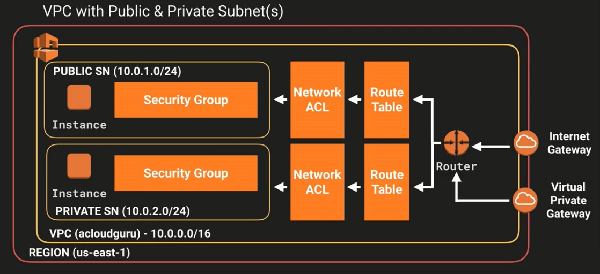

# Section 8: VPC

This section will cover an in-depth overview on AWS VPC.

### What is a VPC?
Think of a VPC (Virtual Private Cloud) as a virtual data center in the cloud. A VPC lets you provision a logically isolated section of the AWS cloud where you can launch AWS resources in a virtual network that you define. You have complete control over you virtual networking environment, including selection of your own IP address range, creation of subnets, and configuration of route tables and network gateways.

  
  <h3>Figure 8-1. Diagram of a VPC setup on AWS</h3>

### What can you do with a VPC?
* Launch instances into a subnet of your choosing
* Assign custom IP address ranges in each subnet
* Configure route tables between subnets
* Create internet gateway and attach it to our VPC
* Much better security control over your AWS resources
* Instance security groups
* Subnet network ACLs (access control lists)

### Default VPC vs Custom VPC
* Default VPC is user friendly, allowing you to immediately deploy instances
* All subnets in default VPC have a route out to the internet
* Each EC2 instance has both a public and private IP address

### Peering VPC
* Allows you to connect one VPC with another via a direct network route using private IP addresses
* Instances behave as if they were on the same private network
* You can peer VPC's with other AWS accounts as well as with other VPC's in the same account
* Peering is in a star configuration: i.e. one central VPC peers with 4 others. No transitive peering

### VPC - Exam Tips
* Think of a VPC as a logical datacenter in AWS
* Consists of IGW (Virtual Private Gateways), route tables, network access control lists, subnets, and security groups
* 1 Subnet = 1 AZ
* Security groups are stateful; network access control lists are stateless
* **No transitive peering**

### Exam Tips - Network ACLs
* Your VPC automatically comes with a default network ACL and by default it allows all outbound and inbound traffic
* You can create custom network ACLs. By default each custom network ACL denies all inbound and outbound traffic until you add rules
* Each subnet in your VPC must be associated with a network ACL. If you do not explicitly associate a subnet with a network ACL, the subnet is automatically associated with a network ACL
* You can associate a network ACL with multiple subnets; however, a subnet can be associated with only one network ACL at a time. When you associate a network ACL with a subnet, the previous associate is removed
* Network ACLs contain a numbered list of rules that is evaluated in order, starting with the lowest numbered rule
* Network ACLs have separate inbound and outbound rules, and each rule can either allow or deny traffic
* Network ACLs are stateless; responses to allow inbound traffic are subject to the rules for outbound traffic (and vice versa)
* Block IP addresses using network ACLs not security groups

### VPC Flow Logs
* VPC Flow Logs is a feature that enables you to capture information about the IP traffic going to and from network interfaces in your VPC. Flow log data is stored using Amazon CloudWatch Logs. After you've created a flow log, you can view and retrieve its data in Amazon CloudWatch Logs.

* Flow logs can be created at 3 levels:
  * VPC
  * Subnet
  * Network interface level

### Exam Tips - VPC Flow Logs
* You cannot enable flow logs for VPCs that are peered with your VPC unless the peer VPC is in your account
* You cannot tag a flow log
* After you've created a flow log, you cannot change its configuration; for example, you can't associate a different IAM role with the flow log

### Not all IP traffic is monitored
* Traffic generated by instances when they contact the Amazon DNS server. If you use your own DNS server, then all traffic to that DNS server is logged
* Traffic generated by a Windows instance for Amazon Windows license activation
* Traffic to the reserved IP address for the default VPC router
* DHCP traffic

### Exam Tips - NATs vs Bastions
* NAT (Network Address Translation) is used to provide internet traffic to EC2 instances in private subnets
* Bastion is used to securely administer EC2 instances (using SH or RDP) in private subnets

### Exam Tips - NAT Instances
* When creating a NAT instance, disable source/destination check on the instance
* NAT instances must be in a public subnet
* There must be a route out of the private subnet to the NAT instance, in order for this to work
* The amount of traffic that NAT instances can support depends on the instance size. If you are bottlenecking, increase the instance size
* You can create high availability using auto scaling groups, multiple subnets in different AZs, and a script to automate failover
* Behind a security group

### Exam Tips - NAT Gateways
* Preferred by the enterprise
* Scale automatically up to 10 GBs
* No need to patch
* Not associated with security groups
* Automatically assigned a public IP address
* Remember to update your route tables
* No need to disable source/destination checks
* More secure than a NAT instance

### Exam Tips - ALB's
* You will need at least two public subnets in order to deploy an ALB (Application Load Balancer)

## Section 8 Quiz

**1. Security groups act like a firewall at the instance level whereas ___ are an additional layer of security that act at the subnet level.**
* ACLs

**2. How many VPC's am I allowed in each AWS Region by default?**
* Five

**3. VPC stands for:**
* Virtual Private Cloud

**4. How many internet gateways can I attach to my custom VPC?**
* One

**5. You have a VPC with both public and private subnets. You have 3 EC2 instances that have been deployed in to the public subnet and each has internet access. You deploy a 4th instance using the same AMI and this instance does not have internet access. What could be the cause of this?**
* The instance needs either an Elastic IP address/Public IP address assigned to it
