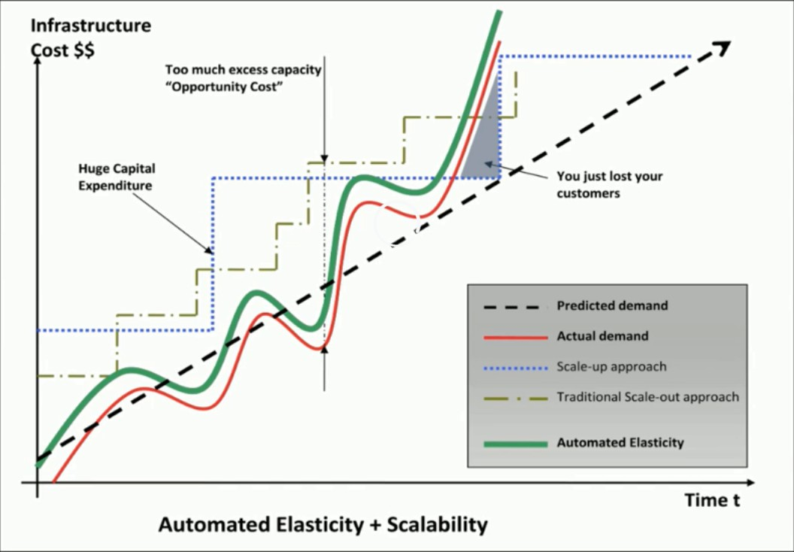
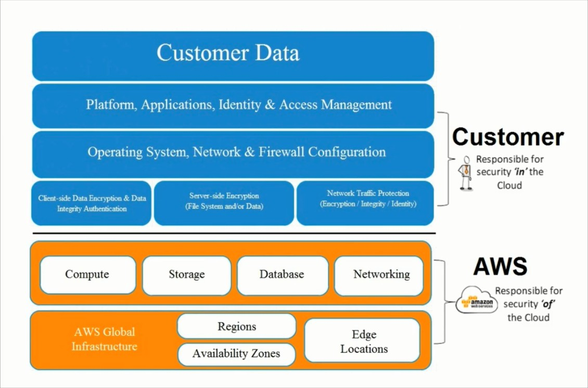

# Section 11: The Well Architected Framework

This section will cover an in-depth overview on AWS Application Services.

### Business Benefits of Cloud
* Almost zero upfront infrastructure investment
* Just-in-time infrastructure
* More efficient resource utilization
* Usage-based costing
* Reduced time to market

### Technical Benefits of Cloud
* Automation - "Scriptable infrastructure"
* Auto-scaling
* Proactive scaling
* More efficient development lifecycle
* Improved testability
* Disaster recovery and business continuity
* "Overflow" the traffic to the cloud

  
  <h3>Figure 11-1. Infrastructure cost vs time</h3>

### Design for Failure
Rule of thumb: be a pessimist when designing architectures in the cloud; assume things will fail. In other words, always design, implement and deploy for automated recovery from failure.

### Decouple Your Components
The key is to build components that do not have tight dependencies on each other, so that if one component were to die, sleep, or remain busy for some reason, the other components in the system are built so as to continue to work as if no failure is happening.

### Implement Elasticity
The cloud brings a new concept of elasticity in your applications. Elasticity can be implemented in three ways:
1. Proactive cyclic scaling: periodic scaling that occurs at fixed interval (daily, weekly, monthly, and quarterly)
2. Proactively event-based scaling: scaling just when you are expecting a big surge of traffic requests due to a scheduled business event (new product launch, marketing campaigns)
3. Auto-scaling based on demand. By using a monitoring service, your system can send triggers to take appropriate actions so that it scales up or down based on metrics (utilization of the servers or network i/o for instance)

### Secure Your Application
Depending on your setup, securing your application is important, see Figure 11-2 on application security at different levels of the application.

  
  <h3>Figure 11-2. Application security at different levels</h3>

### What is a well architected framework?
This has been developed by the Solution Architecture team based on their experience with helping AWS customers. The well architected framework is a set of questions that you can use to evaluate how well your architecture is aligned to AWS best practices.

### Five Pillars of The Well-Architected Framework
* Security
* Reliability
* Performance efficiency
* Cost optimization
* Operational excellence

### Structure of each Pillar
* Design principles
* Definition
* Best practices
* Key AWS services
* Resources

### General Design Principles
* Stop guessing your capacity needs
* Test systems at production scale
* Automate to make architectural experimentation easier
* Allow for evolutionary architectures
* Data-driven architectures
* Improve through game days

### Pillar One - Security Design Principles
* Apply security at all layers
* Enable traceability
* Automate responses to security events
* Focus on securing your system
* Automate security best practices

### Pillar One - AWS Shared Responsibility Model
Shown in Figure 11-3 is the AWS shared responsibility model between AWS and the customer. Although the scope of responsibility differs for AWS vs the customer, each party has equal responsibility in securing data.

  
  <h3>Figure 11-3. AWS shared responsibility model</h3>

### Pillar One - Security Definition
Security in the cloud consist of 4 areas:
1. Data protection
2. Privilege management
3. Infrastructure protection
4. Detective controls

### Pillar One - Best Practices - Data Protection
* Before you begin to architect security practices across your environment, basic data classification should be in place. You should organize and classify your data into segments. You should implement a least privilege access system so that people are only able to access what they need. However, most importantly you should encrypt everything where possible, whether it be at rest or in transit.

* In AWS the following practices help to protect your data:
  * AWS customers maintain full control over their data
  * AWS has designed storage system for exceptional resiliency
  * AWS makes it easier for you to encrypt your data and manage keys, including regular key rotation, which can be easily automated natively by AWS or maintained by a customer
  * Detailed logging is available that contains important content, such as file access and changes
  * Versioning which can be part of a larger data lifecycle management process, can protect against accidental overwrites, deletes, and similar harm
  * AWS never initiates the movement of data between regions. Content is placed in a region will remain in that region unless the customer explicitly enables a feature or leverages a service that provides that functionality

### Pillar One - Best Practices - Data Protection Questions
* How are you encrypting and protecting your data at rest?
* How are you encrypting and protecting your data in transit? (SSL)

### Pillar One - Best Practices - Privilege Management
Privilege management ensures that only authorized and authenticated users are able to access your resources, and only in a manner that is intended. It can include:
* ACLs (Access Control Lists)
* Role-based access controls
* Password management (such as password rotation policies)

### Pillar One - Best Practices - Privilege Management Questions
* How are you protecting access to and use of the AWS root account credentials
* How are you defining roles and responsibilities of system users to control human access to the AWS management console and APIs?
* How are you limiting automated access (such as from applications, scripts, or third-party tools or services) to AWS resources?
* How are you managing keys and credentials

### Pillar One - Best Practices - Infrastructure Protection
Outside of cloud, this is how you protect your data center. RFID controls, security, lockable cabinets, CCTV, etc. Within AWS they handle this, so really infrastructure protection exists at a VPC level.

### Pillar One - Best Practices - Infrastructure Protection Questions
* How are you enforcing network and host-level boundary protection?
* How are you enforcing AWS service level protection?
* How are you protecting the integrity of the operating systems on your Amazon EC2 instances?

### Pillar One - Best Practices - Detective Controls
You can use detective controls to detect or identify a security breach. AWS services to achieve this include:
* AWS S3
* AWS Config
* AWs Glacier
* AWS CloudTrail
* AWS CloudWatch

### Pillar One - Best Practices - Detective Controls Questions
* How are you capturing and analyzing AWS logs?

### Pillar One - Key AWS Services
* Data protection
  * You can encrypt you data both in transit and at rest using EBS, S3, and RDS
* Privilege management
  * IAM, MFA
* Infrastructure protection
  * VPC
* Detective controls
  * AWS CloudTrail, AWS Config, AWS CloudWatch

### Pillar One - Security Exam Tips
Security in the cloud consist of 4 areas:
1. Data protection
2. Privilege management
3. Infrastructure protection
4. Detective controls

Also review each questions section within Pillar One.

### Pillar Two - The Reliability Pillar
The reliability pillar covers the ability of a system to recover from service or infrastructure outages/disruptions as well as the ability to dynamically acquire computing resources to meet demand.

### Pillar Two - Reliability Design Principles
* Test recovery procedures
* Automatically recover from failure
* Scale horizontally to increase aggregate system availability
* Stop guessing capacity

### Pillar Two - Reliability Definition
Reliability in the cloud consists of three areas:
* Foundations
* Change management
* Failure management

### Pillar Two - Best Practices - Foundations
* Before architecting any system, you need to make sure you have the prerequisite foundations. In traditional IT one of the first things you should consider is the size of the communications link between your HQ and your data center. If you under evaluate this link, it can take three to six months to upgrade which can cause a huge disruption to your traditional IT estate

* AWS handles most of the foundations for you. The cloud is designed to be essentially limitless meaning that AWS handle the networking can compute requirements themselves. However, they do set service limits to stop customers from accidentally over-provisioning resources

### Pillar Two - Best Practices - Foundations Questions
* How are you managing AWS service limits for your account?
* How are you planning your network topology on AWS?
* Do you have an escalation path to deal with technical issues?

### Pillar Two - Best Practices - Change Management
* You need to be aware of how change affects a system so that you can plan proactively around it. Monitoring allows you to detect any changes to your environment and react. In traditional systems, change control is done manually and are carefully coordinated with auditing

* AWS makes things a lot easier, you can use CloudWatch to monitor your environment and services such as auto scaling to automate change in response to changes on your production environment

### Pillar Two - Best Practices - Change Management Questions
* How does your system adapt to changes in demand?
* How are you monitoring AWS resources?
* How are you executing change management?

### Pillar Two - Best Practices - Failure Management
You should always architect your systems with the assumptions that failure will occur. You should become aware of these failures, how they occurred, how to respond to them and then plan on how to prevent these from happening again.

### Pillar Two - Best Practices - Failure Management Questions
* How are you backing up your data?
* How does your system withstand component failures?
* How are you planning for recovery?

### Pillar Two - Key AWS Services
* Foundations
  * IAM, VPC
* Change management
  * AWS CloudTrail
* Failure management
  * AWS CloudFormation

### Pillar Two - Reliability Exam Tips
Reliability in the cloud consists of three areas:
* Foundations
* Change management
* Failure management

Also review each questions section within Pillar Two.

### Pillar Three - The Performance Efficiency Pillar
The performance efficiency pillar focuses on how to use computing resources efficiently to meet your requirements and how to maintain that efficiency as demand changes and technology evolves.

### Pillar Three - Performance Efficiency Design Principles
* Democratize advanced technologies
* Go global in minutes
* Use server-less architectures
* Experiment more often

### Pillar Three - Performance Efficiency Definition
Performance efficiency in the cloud consists of four areas:
1. Compute
2. Storage
3. Database
4. Space-time trade-off

### Pillar Three - Best Practices - Compute
* When architecting your system it is important to choose the right kind of server. Some applications require heavy CPU utilization, some require heavy memory utilization, etc

* AWS servers are virtualized and at the click of a button (or API call). You can change the type of server in which your environment is running on. You can even switch to running with no servers at all and use AWS Lambda

### Pillar Three - Best Practices - Compute Questions
* How do you select the appropriate instance type for your system?
* How do you ensure that you continue to have the most appropriate instance type as new instance types and features are introduced?
* How do you monitor your instances post launch to ensure they are performing as expected?
* How do you ensure that the quantity of your instances matches demand?

### Pillar Three - Best Practices - Storage
The optimal storage solutions for your environment depends on a number of factors. For example:
* Access method - block, file or object
* Patterns of access - random or sequential
* Throughput required
* Frequency of access - online, offline or archival
* Frequency of update - worm, dynamic
* Availability constraints
* Durability constraints

* At AWS the storage is virtualized. In S3 you can have 11 x 9's durability, cross region replication, etc. In EBS you can choose between different storage mediums (such as SSD, magnetic, PIOPS, etc). You can also easily move volumes between the different types of storage mediums

### Pillar Three - Best Practices - Storage Questions
* How do you select the appropriate storage solution for your system?
* How do you ensure that you continue to have the most appropriate storage solution as new storage solutions and features are launched?
* How do you monitor your storage solution to ensure it is performing as expected?
* How do you ensure that the capacity and throughput of your storage solutions matches demand?

### Pillar Three - Best Practices - Database
* The optimal database solution depends on a number of factors, do you need database consistency, do you need high availability, do you need No-SQL, and do you need DR etc?
* You get a lot of options in AWS; RDS, DynamoDB, Redshift, etc

### Pillar Three - Best Practices - Database Questions
* How do you select the appropriate database solution for your system?
* How do you ensure that you continue to have the most appropriate database solution and features as new database solution and features are launched?
* How do you monitor your databases to ensure performance is as expected?
* How do you ensure the capacity and throughput of your databases matches demand?

### Pillar Three - Best Practices - Space-time Trade-off
* You can use services such as RDS to add read replicas, reducing the load on your database and creating multiple copies of the database. This helps to lower latency
* You can use Direct Connect to provide predictable latency between your HQ and AWS
* You can use the global infrastructure to have multiple copies of your environment, in regions that is closest to your customer base
* You can also use caching services such as ElastiCache or CloudFront to reduce latency

### Pillar Three - Best Practices - Space-time Trade-off Questions
* How do you select the appropriate proximity and caching solutions for your system?
* How do you ensure that you continue to have the most appropriate proximity and caching solutions as new solutions are launched?
* How do you monitor your proximity and caching solutions to ensure performance is as expected?
* How do you ensure that the proximity and caching solutions you have matches demand?

### Pillar Three - Key AWS Services
* Compute
  * Auto scaling
* Storage
  * EBS, S3, Glacier
* Database
  * RDS, DynamoDB, Redshift
* Space-time Trade-off
  * CloudFront, ElastiCache, Direct Connect, RDS Read Replicas, etc.

### Pillar Three - Performance Efficiency Exam Tips
Performance efficiency in the cloud consists of four areas:
1. Compute
2. Storage
3. Database
4. Space-time trade-off

Also review each questions section within Pillar Three.

### Pillar Four - The Cost Optimization Pillar
Use the cost optimization pillar to reduce your costs to a minimum and use those savings for other parts of your business. A cost-optimized system allows you to pay the lowest price possible while still achieving your business objectives.

### Pillar Four - Cost Optimization Design Principles
* Transparently attribute expenditure
* Use managed services to reduce cost of ownership
* Trade capital expense for operating expense
* Benefit from economies of scale
* Stop spending money on data center operations

### Pillar Four - Cost Optimization Definition
Cost optimization in the cloud consists of four areas:
1. Matched supply and demand
2. Cost-effective resources
3. Expenditure awareness
4. Optimizing over time

### Pillar Four - Best Practices - Matched Supply and Demand
Try to optimally align supply with demand. Don't over or under provision, instead as demand grows, so should your supply of compute resources. Think of things like auto scaling which scale with demand. Similarly in a server-less context, use services such as Lambda that only execute when a requests comes in.

### Pillar Four - Best Practices - Matched Supply and Demand Questions
* How do you make sure your capacity matches but does not substantially exceed what you need?
* How are you optimizing your usage of AWS services?

### Pillar Four - Best Practices - Cost-effective Resources
Using the correct instance type can be key to cost savings.

### Pillar Four - Best Practices - Cost-effective Resources Questions
* Have you selected the appropriate resource types to meet your cost targets?
* Have you selected the appropriate pricing model to meet your cost targets?
* Are there managed services (higher-level services than EC2, EBS, and S3) that you can use to improve your ROI?

### Pillar Four - Best Practices - Expenditure Awareness
You no longer have to go out and get quotes in physical servers, choose a supplier, have those resources delivered, installed, and made available with cloud. You can provision things within seconds. However, this comes with issues as many organizations have different teams, each with their own AWS accounts. Being aware of what each team is spending and where is crucial to any well architected system. You can use cost allocation tags to track this, billing alerts as well as consolidated billing.

### Pillar Four - Best Practices - Expenditure Awareness Questions
* What access controls and procedures do you have in place to govern AWS costs?
* How are you monitoring usage and spending?
* How do you decommission resources that you no longer need, or stop resources that are temporarily not needed?
* How do you consider data-transfer charges when designing your architecture?

### Pillar Four - Best Practices - Optimizing Over Time
AWS moves fast. There are hundreds of new services. A service that you chose yesterday may not be the best service to be using today. You should keep track of the changes made to AWS and constantly re-evaluate your existing architecture.

### Pillar Four - Best Practices - Optimizing Over Time Questions
* How do you manage and/or consider the adoption of new services?

### Pillar Four - Key AWS Services
* Matched supply and demand
  * Auto scaling
* Cost-effective resources
  * EC2 (reserved instances), AWS trusted advisor
* Expenditure awareness
  * CloudWatch Alarms, SNS
* Optimizing over time
  * AWS blog, AWS trusted advisor

### Pillar Four - Cost Optimization Exam Tips
Cost optimization in the cloud consists of four areas:
1. Matched supply and demand
2. Cost-effective resources
3. Expenditure awareness
4. Optimizing over time

Also review each questions section within Pillar Four.

### Pillar Five - Operational Excellence Pillar
* The operational excellence pillar includes operational practices and procedures used to manage production workloads
* This includes how planned changes are executed, as well as responses to unexpected operational events
* Change execution and responses should be automated. All processes and procedures of operational excellence should be documented tested, and regularly reviewed

### Pillar Five - Operational Excellence Design Principles
* Perform operations with code
* Align operations processes to business objectives
* Make regular, small, incremental changes
* Test for responses to unexpected events
* Learn from operational events and failure
* Keep operation procedures current

### Pillar Five - Operational Excellence Definition
There are three best practice areas for operational excellence in the cloud:
* Preparation
* Operation
* Response

### Pillar Five - Best Practices - Preparation
* Effective preparation is required to drive operational excellence
* Operation checklists will ensure that workloads are ready for production
* Operation and prevent unintentional production promotion without effective preparation
* Workloads should have:
  * Runbooks - operations guidance that operation teams can refer to so they can perform normal daily tasks
  * Playbooks guidance for responding to unexpected operational events. Playbooks should include response plans, as well as escalation paths and stakeholder notifications

* CloudFormation can be used to ensure that environments contain all required resources when deployed in production and that the configuration of the environment is based on tested best practices, which reduces the opportunity for human error

* Implementing auto scaling, or other automated scaling mechanisms, will allow workloads to automatically respond when business-related events affect operational needs
* Services like AWS Config with the AWS Config rules feature create mechanisms to automatically track and respond to changes in your AWS workloads and environments
* It is also important to use feature like tagging to make sure all resources in a workload can be easily identified when needed during operations and responses

### Pillar Five - Best Practices - Preparation Questions
The following questions focus on preparation considerations for operational excellence:
* What best practices for cloud operations are you using?
* How are you doing configuration management for your workload?

### Pillar Five - Best Practices - Operations
* Operations should be standardized and manageable on a routine basis. The focus should be on automation, small frequent changes, regular quality assurance testing, and defined mechanisms to track, audit, rollback, and review changes. Changes should not be large and infrequent, they should not require scheduled downtime, and they should not require manual execution. A wide range of logs and metrics that are based on key operational indications for a workload should be collected and reviewed to ensure continuous operations

* In AWS you can set up a continuous integration/continuous deployment (CI/CD) pipeline. Release management processes, whether manual or automated, should be tested and be based on small incremental changes, and tracked versions. You should be able to revert changes that introduce operational issues without causing operational impact

### Pillar Five - Best Practices - Operations Questions
The following questions focus on operations considerations for operational excellence:
* How are you evolving your workload while minimizing the impact of change?
* How do you monitor your workload to ensure it is operating as expected?

### Pillar Five - Best Practices - Responses
* Responses to unexpected operational events should be automated. This is not just for alerting but also for mitigation, remediation, rollback, and recovery
* In AWS, there are several mechanisms to ensure both appropriate alerting and notification in response to unplanned operational events, as well as automated responses

### Pillar Five - Best Practices - Responses Questions
The following questions focus on operations considerations for operational excellence:
* How do you respond to unplanned operational events?
* How is escalation managed when responding to unplanned operational events?

### Pillar Five - Key AWS Services
**Preparation**: AWS Config provides a detailed inventory of your AWS resources and configuration, and continuously records configuration changes. AWS Service Catalog helps to create a standardized set of service offerings that are aligned to best practices. Designing workloads that use automation with services like Auto Scaling and SQS are good methods to ensure continuous operations in the event of unexpected operational events.

**Operations**: AWS CodeCommit, CodeDeploy, and CodePipeline can be used to manage and automate code changes to AWS workloads. Use AWS SDKs or third-party libraries to automate operational changes. Use AWS CloudTrail to audit and track changes made to AWS environments.

**Reponses**: CloudWatch alarms can be used to set thresholds for alerting and notification. CloudWatch events can trigger notifications and automated responses.

### Pillar Five - Operational Excellence Exam Tips
There are three best practice areas for operational excellence in the cloud:
* Preparation
* Operation
* Response

Also review each questions section within Pillar Five.

### Summary of The Well Architected Framework
Review each "Exam Tips" section in each pillar as well as the "Questions" section in each pillar.

## Section 11 Quiz (Mega Quiz)

**1. Amazon SWF is designed to help users:**
* Coordinate synchronous and asynchronous tasks

**2. In RDS, what is the maximum value I can set for my backup retention period?**
* 35 Days

**3. Automated backups are enabled by default for a new DB Instance?**
* True

**4. Amazon RDS does not currently support increasing storage on a ____ Db instance**
* SQL Server

**5. In what circumstances would I choose provisioned IOPS in RDS over standard storage?**
* If you use production online transaction processing

**6. Amazon's S3 is:**
* Object based storage

**7. In S3 with RRS the availability is:**
* 99.99%

**8. Amazon's EBS volumes are:**
* Blocked based storage

**9. If I want to run a database on an EC2 instance, which is the most recommended Amazon storage option?**
* EBS

**10. In S3 the durability of my files is:**
* 99.999999999%

**11. Can you access Amazon EBS Snapshots?**
* Yes, through the AWS APIs/CLI and AWS console

**12. A __________ is a document that provides a formal statement of one or more permissions.**
* Policy

**13. In a default VPC, all Amazon EC2 instances are assigned 2 IP addresses at launch, what are these?**
* Private IP address and public IP address

**14. If an Amazon EBS volume is the root device of an instance, can I detach it without stopping the instance?**
* No

**15. If you want your application to check whether a request generated an error then you look for an ______ node in the response from the Amazon RDS API**
* Error

**16. EC2 instances can have credentials stored on them so that the instances can access other resources (such as S3 buckets) and AWS recommends that you do this instead of assigning roles.**
* False

**17. Can I move a reserved instance from one region to another?**
* No

**18. In S3 RRS the durability of my files is:**
* 99.99%

**19. In RDS, changes to the backup window take effect:**
* Immediately

**20. In RDS what is the maximum size for a Microsoft SQL Server DB Instance with SQL Server Express edition?**
* 10 GB per database

**21. In S3 what does RRS stand for?**
* Reduced Redundancy Storage

**22. Can I "force" a failover for any RDS instance that has Multi-AZ configured?**
* Yes

**23. What does EBS stand for?**
* Elastic Block Storage

**24. You can conduct your own vulnerability scans within your own VPC without alerting AWS first?**
* False

**25. Reserved instances are available for multi-AZ deployments.**
* True

**26. Amazon's Glacier service is a Content Distribution Network which integrates with S3.**
* False

**27. MySQL installations default to port number:**
* 3306

**28. If an Amazon EBS volume is an additional partition (i.e. not the root volume), can I detach it without stopping the instance?**
* Yes, although it may take some time

**29. Every user you create in the IAM systems starts with _____**
* No Permissions

**30. You can RDP or SSH in to an RDS instance to see what is going on with the operating system.**
* False

**31. When creating a new security group, all in bound traffic is allowed by default.**
* False

**32. To save administration headaches, Amazon recommend that you leave all security groups in web facing subnets open on port 22 to 0.0.0.0/0 CIDR, that way you can connect where ever you are in the world.**
* Incorrect

**33. What are the four levels of AWS premium support?**
* Basic, Developer, Business, Enterprise

**34. As the AWS platform is PCI DSS 1.0 compliant, I can immediately deploy a website to it that can take and store credit card details. I do not need to get any kind of delta accreditation from a QSA.**
* False

**35. To help you manage your Amazon EC2 instances you can assign your own metadata in the form of:**
* Tags

**36. Which statement best describes Availability Zones?**
* Distinct locations within an AWS region that are engineered to be isolated from failures

**37. The service to allow Big Data Processing on the AWS platform is known as AWS "Elastic Big Data".**
* False

**38. Individual instances are provisioned in:**
* Availability Zones

**39. When using a custom VPC and placing an EC2 instance in to a public subnet, it will be automatically internet accessible (i.e. you do not need to apply an elastic IP address or ELB to the instance).**
* False

**40. What is the underlying Hypervisor for EC2?**
* Xen

**41. The AWS platform is certified PCI DSS 1.0 compliant**
* True

**42. The AWS platform consists of how many regions currently?**
* 14

**43. How many copies of my data does RDS - Aurora store by default?**
* 6

**44. Amazon's product debut conference is held in Las Vegas each year and is known as:**
* Re-Invent

**45. What is the difference between Elastic Beanstalk & CloudFormation?**
* Elastic Beanstalk automatically handles the deployment, from capacity provisioning, load balancing, auto-scaling to application health monitoring based on the code you upload to it, whereas CloudFormation is an automated provisioning engine designed to deploy entire cloud environments via a JSON script

**46. In RDS, you are responsible for maintaining OS & Application security patching, antivirus etc.**
* False

**47. What is the maximum response time for a Business Level Premium Support Case?**
* 1 Hour

**48. When I create a new security group, all outbound traffic is allowed by default.**
* True

**49. What types of RDS databases are currently available?**
* Oracle, SQL, MySQL, Postgres

**50. I can enable multifactor authentication by using:**
* IAM

**51. When deploying databases on your own EC2 instances, it is recommended that you deploy these on magnetic storage rather than SSD storage as you get better performance.**
* False

**52. AWS DNS service is known as:**
* Route 53

**53. Auditing user access/API calls etc across the entire AWS estate can be achieved by using:**
* CloudTrail
